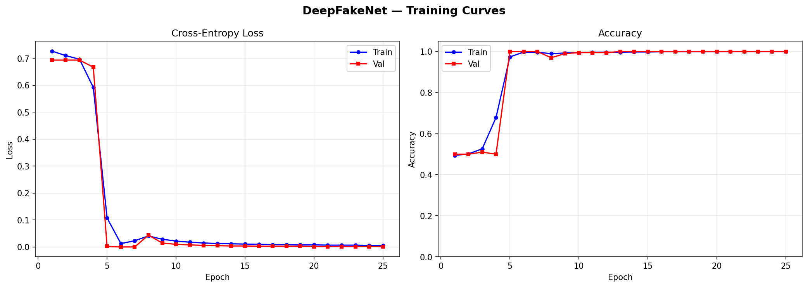
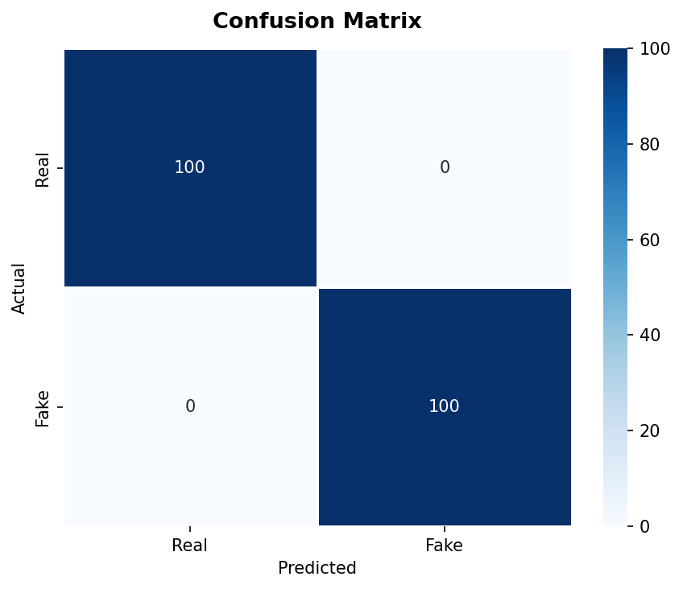
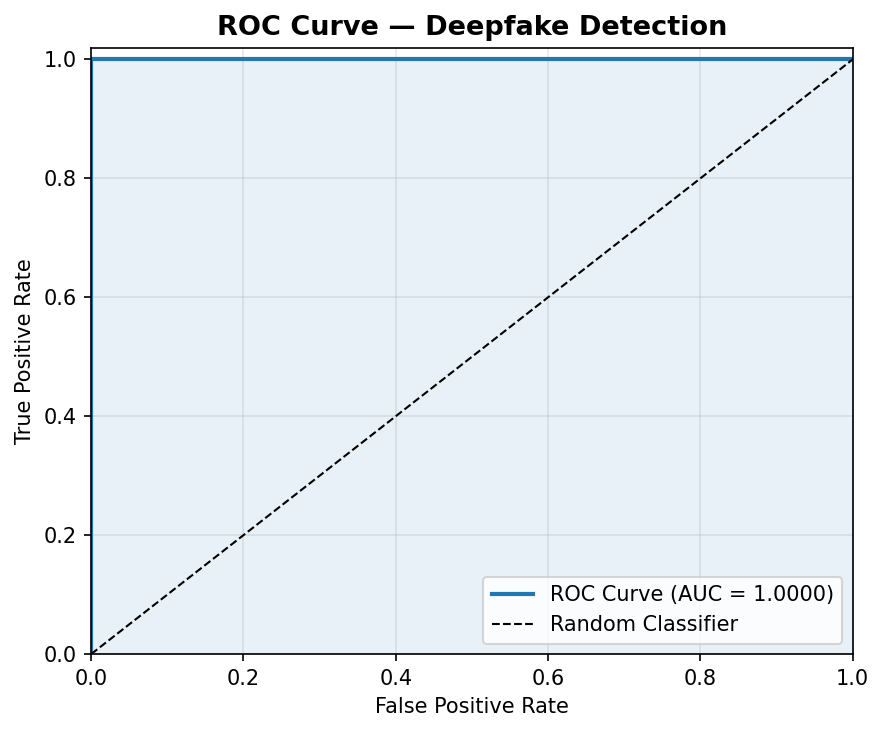

# Deepfake_Detector_Using_CNN
An end-to-end computer vision and deep learning project designed to detect manipulated facial imagery and deepfake content. This repository contains the detection pipeline, training routines, and evaluation metrics.

Detailed methodology, dataset breakdowns, and theoretical foundations can be found in the [Full Project Report](docs/Deepfake_Detection_Report.pdf).

---

## 📌 Features
- **Face Extraction & Preprocessing**: Detects, crops, and normalizes facial regions from image and video inputs.
- **Deep Feature Representation**: Leverages a convolutional backbone for robust artifact and boundary inconsistency classification.
- **Comprehensive Evaluation**: Evaluated using ROC curves, Confusion Matrices, and Loss/Accuracy tracking across epochs.

---

## 📊 Performance & Evaluation

The model was evaluated on held-out test data. Below are the key training and validation diagnostic curves:

### 1. Training & Validation Curves
Tracks cross-entropy loss and classification accuracy over training epochs:



### 2. Confusion Matrix
Displays true positive, true negative, false positive, and false negative rates across the test split:



### 3. ROC Curve
Area Under the Curve (AUC) measuring the true positive rate versus false positive rate trade-off across varying decision thresholds:



---

## 🚀 Getting Started

### Prerequisites
Make sure you have Python 3.8+ installed. A GPU environment with CUDA support is recommended for training and fast inference.

### Installation
1. Clone the repository:
   ```bash
   git clone [https://github.com/your-username/deepfake-detection.git](https://github.com/your-username/deepfake-detection.git)
   cd deepfake-detection
